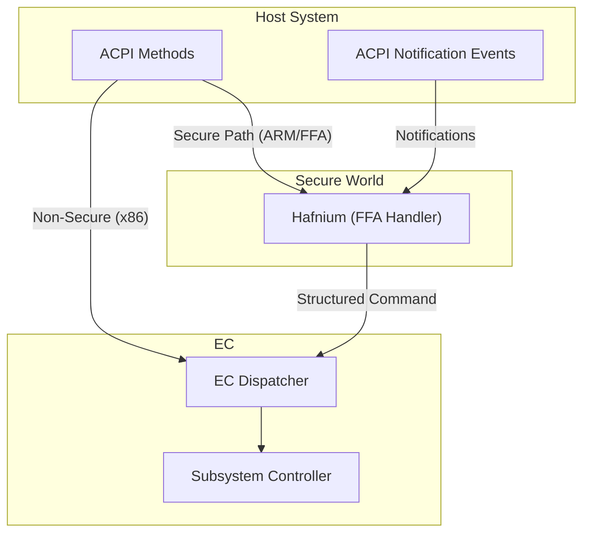

# Secure EC Services

> **Figure: Host-EC Communication Paths**
>
> The host communicates with the EC via **ACPI** calls and notification
> events. On **ARM** platforms with secure world enforcement, messages are
> routed through **Hafnium** via **FF-A** interfaces. On **x86** platforms,
> communication is direct. The EC dispatcher then forwards commands to
> appropriate subsystem controllers.
